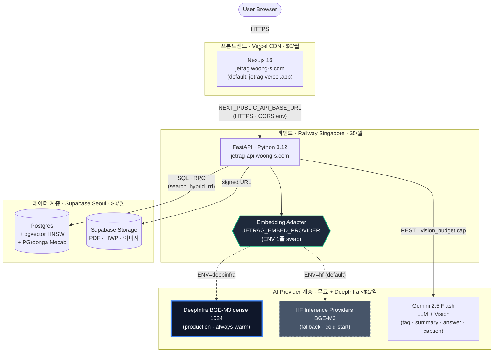
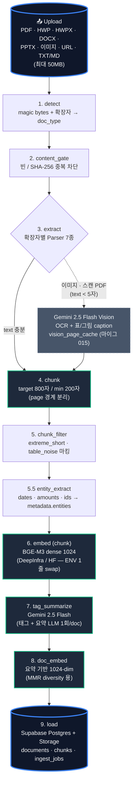
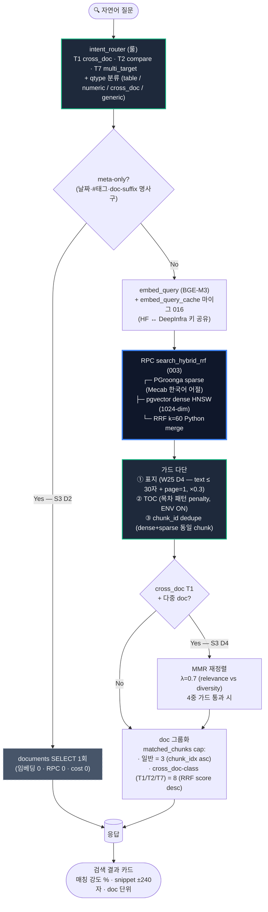
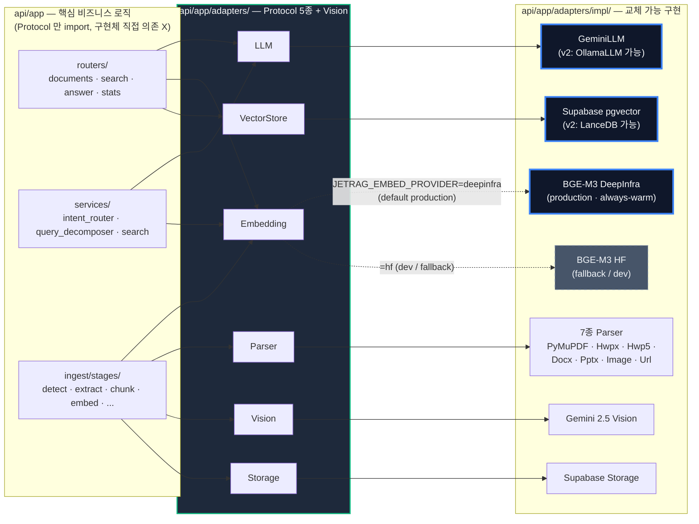

# Jet-Rag

[](https://github.com/woongminKi/Jet-Rag/actions/workflows/ci.yml)

> 한국 직장인을 위한 멀티포맷 RAG 기반 개인 지식 에이전트.
>
> "정리하지 않아도, 기억의 단편으로 꺼내 쓰는 앱."

**상태**: v0.1 MVP — **production live** (2026-05-18 배포 → 2026-05-19 도메인 부착 → 2026-05-21 D1+D2 ship + E4 fix) / 검색 정확도 80% PRD **M0~M2 완료** (top-1 0.7966 — 0.80 게이트 noise band 내 사실상 달성, M2 W-4 `beb83b4`) / 단위 테스트 **1300+ PASS** (baseline flaky 3 동일) / 마이그레이션 **20개** (017~020 = invite_codes + 018 이관 + 019 RLS + 020 Storage prefix) / commit 누적 **563+**.
**목적**: **이직 포트폴리오** + 페르소나 A (한국 직장인) 개인 지식 보조. 공공·대기업 비IT 실무자가 일상적으로 받는 HWP/HWPX·PDF·DOCX·이미지·URL 자료를 자연어로 역검색.

## 🚀 라이브 사이트

**👉 <https://jetrag.woong-s.com>** — 로그인 없이 즉시 사용 가능. 미리 인덱싱된 **12개 한국어 문서**(사업보고서·법률판례·정책·학술논문·이력서) 위에서 검색·답변 시연.

### 추천 검색어

홈 화면 검색바 아래 칩을 클릭하면 즉시 검색됩니다. 또는 직접 입력:

| 추천 query | 시연 포인트 |
|---|---|
| `2026 한국 경제 성장률 전망` | sample-report 경제전망 + 정량 답변 (성장률·물가·경상수지) |
| `SK 사업보고서 매출 흐름` | DART 공시 PDF 표 데이터 vision OCR |
| `하도급 직접지급합의 묵시적 해지 요건` | 법률 RAG (복잡한 한국어 문장 + 판례 인용) |
| `데이터센터 산업 활성화 지원 사업 내용` | 정책 문서 다중 단락 추론 |
| `기웅민 이력서 프로젝트 경험` | 본인 이력서 — 자기소개 query 어필 |

### 현재 운영 모드 — 데모 병행 (수익화 W1)

- **익명 방문자**: owner 인덱싱 12 docs 위에서 검색·답변·태그 탐색 read-only 데모 (온보딩 퍼널)
- **로그인 유저**: `/ingest` 업로드 → 본인 user_id 격리 컨텍스트 (RLS 마이그 019/020) 에서 인제스트·검색·답변
- **쓰기 게이트**: 업로드·재인제스트·feedback·eval 7 endpoint 는 `require_authenticated_user` — 익명 시 401
- **admin 게이트**: `require_admin` — 익명 fallback 은 user_id 가 owner 와 같아도 403 (is_authenticated 체크)
- **일일 rate limit (W2)**: 익명 데모(IP 기준)·로그인 사용자(user_id 기준) 모두 일일 답변 50회 / 업로드 30회 상한 — 초과 시 429. `JETRAG_RATE_LIMIT_*` ENV 로 조정(0=무제한).
- **플랜 quota (W3)**: 로그인 사용자는 Free(보유 문서 10 · 답변 일 5회) / Pro(200 · 50회) 한도 — 초과 시 402 + 업그레이드 안내. 한도는 `plans` 테이블 seed(UPDATE 로 조정). 익명 데모는 W2 rate limit(429)만 적용.

### 📱 모바일에서 설치하기 (PWA)

App Store / Play Store 등록 **없이** 폰 브라우저로 직접 설치 가능 — PWA (Progressive Web App) 방식:

- **Android (Chrome)**: `jetrag.woong-s.com` → 우상단 ⋮ → **"앱 설치"** → 홈 화면 아이콘 생성
- **iOS (Safari)**: `jetrag.woong-s.com` → 하단 공유 ↑ → **"홈 화면에 추가"** → 홈 화면 아이콘 생성

설치 후 standalone (주소창 없는 풀스크린) 모드로 동작. PDF 를 다른 앱에서 Jet-Rag 로 직접 공유하는 진입점도 지원:
- **Android**: Acrobat·Drive·파일 앱의 공유 시트에서 "Jet-Rag" 한 번 탭 (PWA `share_target` 자동 등록)
- **iOS**: 단축어 앱 1회 설정 (~3분) 으로 공유 시트 진입점 추가

(공유 업로드는 로그인 세션 필요 — 익명 시 401 한국어 wrap 응답. 로그인 후 본인 user_id 격리 컨텍스트로 인제스트)

**관련 문서**:
- 비개발자 사용 가이드: [`work-log/2026-05-28 베타테스터 안내문 — Jet-Rag 설치·사용법.md`](./work-log/2026-05-28%20베타테스터%20안내문%20—%20Jet-Rag%20설치·사용법.md)
- iOS Shortcuts 설정: [`work-log/2026-05-28 iOS Shortcuts PDF 공유 가이드.md`](./work-log/2026-05-28%20iOS%20Shortcuts%20PDF%20공유%20가이드.md)
- 개발자/QA 실기기 검증: [`work-log/2026-05-28 실기기 검증 가이드 — iOS + Android.md`](./work-log/2026-05-28%20실기기%20검증%20가이드%20—%20iOS%20+%20Android.md)

## Production (live)

| 컴포넌트 | URL | 호스팅 | 월 비용 |
|---|---|---|---:|
| Frontend (custom) | <https://jetrag.woong-s.com> | Vercel Hobby | $0 |
| Frontend (default) | <https://jetrag.vercel.app> | Vercel Hobby | $0 |
| Backend (custom) | <https://jetrag-api.woong-s.com> | Railway Hobby (Singapore) | $5 |
| Backend (default) | <https://jet-rag-production.up.railway.app> | Railway Hobby (Singapore) | (위에 포함) |
| DB / Storage | Supabase (Seoul) | Supabase Free | $0 |
| 임베딩 | `BAAI/bge-m3` via DeepInfra (always-warm) | DeepInfra pay-per-token | < $1 |
| 생성 LLM | Gemini 2.0 Flash | Google AI Studio Free | $0 (cap 안) |

**총 운영비**: **~$5~6/월** (도메인 `woong-s.com` 별도 ~$10/년 Cloudflare Registrar).

**검증 성과** (2026-05-19 v1.5 W-2):
- KPI #10 production P95 검색 응답 **1.705s** (게이트 2.5s 의 32% 여유, 60 warm 호출)
- DeepInfra ↔ HF Inference Providers 어댑터 swap R@10 회귀 **0.0000** (115/115 row top-5 ordering 100% 일치, W-0 cosine 0.999984 보증)
- CORS env 화 + Vercel/Railway 자동 SSL → 도메인 부착 시 **코드 변경 0**

## 아키텍처

### 고수준 (4-tier 분리 배포)



> **4-tier 분리 배포** — 프론트엔드 (Vercel) / 백엔드 (Railway Singapore) / 데이터 (Supabase Seoul) / AI Provider (DeepInfra + Gemini). 어댑터 계층이 embedding provider 의 swap path 를 ENV 1줄로 추상화 — **HF Inference Providers ↔ DeepInfra production 간 R@10 회귀 0.0000 으로 검증** (W-0 결정성 시험 cosine 0.999984, 호출 사이트 8건 무수정). 총 운영비 **~$5~6/월** + 도메인 ~$10/년.

### 인제스트 파이프라인 (9 stage + Vision rerouting)



> **확장자 무관 공통 흐름** — 7 Parser 가 `text` 를 일관 추출, Vision rerouting 은 스캔 PDF / 이미지 / 텍스트 < 5자 PDF 페이지에서만 발화 (`vision_budget` cap). caption prefix (`[표 p.N: cap]`) 가 검색에 직접 노출 — M2 W-3 의 `caption_dependent gap +0.28 → +0.012` 효과 (96% 압축). entity_extract 는 chunk 의 sub-step (검색에서는 default OFF, factor 1.10 mock).

### 검색 파이프라인 (intent routing + Hybrid RRF)



> **default 경로는 여전히 Hybrid RRF + 표지/TOC 가드 + doc 그룹** — reranker(D6 net-neg 확정), paid query decomposition(S3 D3, /answer 한정 + budget cap), entity_boost(S4-B ablation 결론 OFF) 는 모두 default OFF 또는 좁은 발화 범위. KPI #7 qtype-aware 우세 실증: table top-1 **+0.34** / numeric top-1 **+0.43** / cross_doc R@10 **+0.045**. KPI #10 production P95 **1.705s** (게이트 2.5s 의 32% 여유, 60 warm 호출).

### 어댑터 layer (5 Protocol + impl swap path)



> **기획서 §9.4 직교성 실증** — DeepInfra ↔ HF 임베딩 어댑터 swap 시 호출 사이트 **8건 무수정**, R@10 회귀 **0.0000** (115/115 row top-5 ordering 100% 일치, W-0 cosine 0.999984 사전 검증). v2 에서 Ollama LLM + LanceDB VectorStore 로컬 전환도 동일 패턴 — 코어 비즈니스 로직 변경 0 + ENV 1줄.

## 진척 현황

### MVP (W1~W21, 2026-04-22 ~ 2026-05-03)
- ✅ 9 stage 인제스트 파이프라인 (extract → chunk → chunk_filter → content_gate → tag_summarize → load → embed → doc_embed → dedup)
- ✅ 하이브리드 검색 (PGroonga sparse + pgvector dense + RRF k=60) + 진정 ablation RPC (008 split RPC)
- ✅ 시계열 추세 시각화 + metrics 영속화 + 두 단계 quota 보호

### 검색 정확도 80% PRD (W22~W26, 2026-05-04 ~ 2026-05-15)
- ✅ **M0** 측정 기반 정비 — golden_v2 라벨 재검수 (broken row 정정) · embed-cache 마이그 016 · baseline 재측정 사인오프
- ✅ **M1** cross_doc + synonym 핀포인트 4종 시도 — 전부 net-neg 실증 (search-side 막다른 골목 확정, ENV default OFF 로 코드 보존)
- ✅ **M2** chunk augmentation + 클린 재인제스트 — `[표 p.N: cap]` caption prefix (`6588053`), 전체 13 doc 재인제스트 (`beb83b4`)
  - **top-1 0.7910 → 0.7966** (게이트 0.80 의 -0.0034pp = noise floor 안, **사실상 달성**)
  - **table_lookup top-1 0.5 → 0.92** (대폭 향상)
  - **caption_dependent gap +0.28 → +0.012** (W-3 효과 96% 압축)
  - cross_doc R@10 +0.032
- ✅ **M3** KPI 7개 자동 측정 마감 (4 ✅ / 3 ❌ "현재 + 가설")
  - ✅ #4 RAGAS Faithfulness 0.908 / ✅ #5 Answer Relevancy 0.801 / ✅ #7 하이브리드 우세 (DECISION-13 qtype-aware) / ✅ #10 P95 174ms
  - ❌ #6① R@10 0.6738 / ❌ #9 환각률 9.2% / ❌ #11 인제스트 SLO 48.3%
- ✅ **DECISION-12** 인제스트 KPI #1·#2·#3 인프라 측정 — 현 corpus 12 doc 기준 모두 게이트 초과 (8/8 · 11/11 · 201/201)

### v1.5 sprint (DeepInfra swap, W30 2026-05-18 ~ 2026-05-19)
- ✅ **W-0** 결정성 시험 — n=100, min cosine **0.999984** ≥ 0.999 PASS → 캐시 entry 공유 안전, dense_vec 재인제스트 불요 (`e57c3ec`)
- ✅ **W-1** DeepInfra OpenAI-compatible 어댑터 — `JETRAG_EMBED_PROVIDER` ENV 1줄 토글, 호출 사이트 8건 무수정 (`4396913`)
- ✅ **W-2** production 측정 + DECISION-14 — P95 1.705s · R@10 회귀 0 · 단위 테스트 1219 → 1229 (`155653b`)

### Deploy sprint (W29~W30, 2026-05-18 ~ 2026-05-19)
- ✅ Railway Dockerfile + Vercel 배포 + CORS env 화 (`e57c3ec`)
- ✅ DECISION-13 — 배포 D 안 (Railway + Vercel + DeepInfra) production 도달 (`6361894`)
- ✅ 도메인 부착 — `woong-s.com` (Cloudflare Registrar) + `jetrag.woong-s.com` + `jetrag-api.woong-s.com`, **코드 변경 0** (`c2c4e26`)

### W31 멀티유저 sprint — D1 Auth + D2 RLS + E4 fix (2026-05-20 ~ 2026-05-21)
- ✅ **D1 Auth 인프라** — Supabase JWT (ES256/HS256 분기 + JWKS), `invite_codes` (마이그 017), `JETRAG_AUTH_ENABLED` 토글, `OWNER_USER_ID` admin 게이트, IDOR 차단 (`da5c640` + `2822ca5` + `96ac048` work-log)
- ✅ **D2 멀티유저 격리** — 7 테이블 RLS 25 정책 (마이그 019, documents/chunks EXISTS join/ingest_jobs/ingest_logs 2-hop/answer_feedback/answer_ragas_evals/invite_codes) + Storage `user/<uid>/` prefix 4 정책 (마이그 020) + RPC `get_chunks_stats_for_user` SECURITY DEFINER + GRANT service_role only (`31f1e9a`)
- ✅ **D1 Phase 4 데이터 이관** — 018 SQL 17 row legacy→owner UPDATE (documents 12 / answer_feedback 1 / answer_ragas_evals 4) via admin REST API, Railway `OWNER_USER_ID` upsert via GraphQL `variableUpsert` (자동 redeploy 트리거) — 사용자 작업 0건 dashboard, 모든 단계 automation (`96ac048` 종합)
- ✅ **D2 Phase 5 RLS+Storage** — 019 RLS apply (사용자 SQL Editor) + 020 PART 1 storage_path PATCH (PostgREST) + script native move 12 객체 (~6초) + 020 PART 2 Storage RLS apply
- ✅ **E4 fix** — `require_authorized_user` dependency 추가 + 4 라우터(`/documents`, `/search`, `/answer`, `/stats`) 적용 → invite redeem 안 한 user 가 backend API 직접 호출로 베타 cap 우회 risk 차단. 단위 테스트 +8 PASS (`378b8db`)
- ✅ **README 다이어그램 3종 + 데모 GIF 가이드** — 인제스트 9-stage + 검색 파이프라인 (intent + Hybrid RRF) + 어댑터 5 Protocol + DeepInfra↔HF swap path (`e5640c6`)

**누적 검증**: 단위 테스트 1336+ PASS / production smoke 401·200·12 doc inbox / Storage 무인증 GET 400 / Railway deploy SUCCESS.

### 수익화 sprint W2~W4 (2026-07-04 ~ 2026-07-07)
- ✅ **W2 rate limit** — `usage_counters` 기반 per-user 일일 abuse cap (answers/docs, 429) + Gemini 유료 키 전환
- ✅ **W3 plans/quota** — `plans`·`subscriptions` (마이그 022) + 플랜 한도 402 게이트 (`JETRAG_QUOTA_ENFORCEMENT_ENABLED`)
- ✅ **W4 이메일 인제스트 (Pro 전용)** — Cloudflare Email Routing catch-all `@in.woong-s.com` → Email Worker (`workers/email-ingest`) → `POST /ingest/email` (공유 시크릿 + 발신자 화이트리스트 + Pro 게이트 fail-closed) → 업로드 동일 게이트 (확장자·50MB·magic·dedup) → `source_channel='email'` 인제스트. `/settings` 에서 주소 확인·재발급. 실메일 e2e PASS (수집→청킹→임베딩 83초)

---

## 데모

> 화면 녹화 산출물 — production endpoint <https://jetrag.woong-s.com> 동작 시연.
> 시나리오 3종 (검색 / 인제스트 / RAG 답변) — 녹화·변환·임베드 가이드는 [`docs/demo/README.md`](docs/demo/README.md) 참조.

<!-- 녹화 후 활성화:
### 검색


> 자연어 질문 → Hybrid RRF (PGroonga sparse + pgvector dense) → doc 그룹 결과 카드 + 매칭 강도 % + snippet ±240자. KPI #10 production P95 **1.705s** (60 warm 호출).

### 인제스트


> PDF/HWP/HWPX/DOCX/PPTX/이미지/URL 5경로 9-stage. 스캔 PDF · 이미지는 Vision rerouting (vision_budget cap). 표/그림 caption 이 검색에 직접 노출.

### RAG 답변


> Gemini 2.5 Flash + 출처 highlight + Ragas Faithfulness/Answer Relevancy 점수. KPI #4 **0.908** / #5 **0.801**.
-->

**준비 중** — gif 파일 commit 후 위 placeholder 활성화.

---

## 문제

한국 직장인은 하루에 HWP·PDF·스크린샷·URL 20건을 받지만 일주일 뒤엔 무엇을 받았는지도, 어디에 있는지도 기억하지 못한다. 기존 도구(Notion AI / Mem / Apple Notes / Obsidian / Evernote)는 **HWP 미지원 + 한국어 RAG 취약 + 공공·대기업 보안 정책과 충돌**로 이 페르소나를 커버하지 못한다.

## 해결 접근

1. **멀티포맷 인제스트** — HWP/HWPX·PDF·DOCX·이미지·URL 5경로
2. **Vision 캡셔닝 + OCR 2-pass** — 표·다이어그램·화이트보드까지 검색 가능화
3. **하이브리드 검색** — BM25 + Vector + RRF + 메타 필터
4. **쿼리 라우팅** — "지난달"·"이 파일만" 같은 자연어 제약을 스코프/필터로 변환
5. **Ragas 평가 루프** — "잘 되는 척"이 아니라 수치로 증명

---

## 포트폴리오 어필 포인트

이직 포트폴리오로서의 강조점 5가지:

### 1. 4-tier production 운영
Railway (backend) · Vercel (frontend) · Supabase (DB·Storage) · DeepInfra (embedding) — 4개 SaaS 를 stateless backend + ENV 토글로 결합, **월 ~$5~6** 로 운영 부담 0 달성. 도메인 부착도 dashboard + ENV 갱신만으로 **코드 변경 0**.

### 2. 어댑터 layer 직교성 (기획서 §9.4 실증)
`api/app/adapters/` 의 `LLM` / `Embedding` / `VectorStore` / `Parser` / `Storage` 5개 Protocol 로 외부 의존성 격리. **HF Inference Providers ↔ DeepInfra ENV 1줄 swap, R@10 회귀 0.0000** (115/115 row top-5 ordering 100% 일치) 으로 어댑터 내러티브 실증. 호출 사이트 8건 무수정.

### 3. 측정 문화 (Ragas + golden_v2 + 결정성 시험)
- **golden_v2** 182 row 자체 골든셋 (broken row 라벨 재검수 거친 사용자 보강)
- **Ragas** Faithfulness / Answer Relevancy / Context Precision 자동 측정 + Gemini 2.5 Flash judge
- **결정성 시험** — DeepInfra swap 전 n=100 cosine 0.999984 ≥ 0.999 사전 검증 → 캐시 호환 + R@10 회귀 0 이론 보장
- **noise floor 도달 확인** — top-1 ±0.012 변동 인제스트 비결정성 정량화, surgical 실험 종결 판단

### 4. 한국어 멀티포맷 RAG + 멀티모달
- BGE-M3 (1024-dim dense + sparse) — 한국어 다국어 강건성
- Gemini 2.0 Flash **Vision** — 표·다이어그램·화이트보드 캡셔닝 (vision 201장 누적, $1.72)
- **PGroonga** 토큰 분석 (Mecab) — 한국어 어절 sparse
- **하이브리드 RRF k=60** (dense + sparse + RRF Python merge) → KPI #7 qtype-aware 우세 실증

### 5. 운영 정합 설계
- **Cloud → Local 전환 경로** — v2 에 Ollama + LanceDB 로 ENV swap 만으로 전환 가능
- **graceful degrade** — 휴리스틱 fail 시 fallback (HwpxParser → DocxParser → PyMuPDFParser)
- **두 단계 quota 보호** — Vision cap + fast-fail + class-based + tag_summarize summary skip
- **RLS + per-user 격리 ✅ ship 완료** (2026-05-21) — **D1 Auth** (Supabase JWT, ES256 + JWKS 분기, invite_codes 게이트, OWNER_USER_ID admin) + **D2 RLS** (7 테이블 25 정책 + RPC `get_chunks_stats_for_user` SECURITY DEFINER + GRANT service_role only + Storage RLS 4 정책 + user/<uid>/ prefix native move) + **E4 fix** (`require_authorized_user` dependency — 4 라우터 redeem 검증). 베타 30명 공개 게이트 해소 — senior-qa 의 P0/P1 차단 모두 닫힘.

---

## 기술 스택 (2026-05-19 v1.5 W-2 PASS 기준)

| 레이어 | 선택 |
|---|---|
| Backend | FastAPI (Python 3.12, uv) · Dockerfile (Railway RAILPACK) |
| Frontend | Next.js 16 + Tailwind v4 + shadcn/ui (new-york, neutral) + Noto Sans KR + 'use client' Server initial / Client refetch 패턴 |
| DB / Storage | Supabase (Postgres + pgvector HNSW + Storage, Seoul region) — 마이그레이션 16개 (`api/migrations/`) |
| Sparse FTS | PGroonga TokenBigram (Mecab) — 한국어 어절 sparse 검색 |
| 임베딩 | **BGE-M3** (dense 1024) — `JETRAG_EMBED_PROVIDER` ENV 토글 (`hf` default / `deepinfra` production) + LRU cache + 영구 캐시 (마이그 016) |
| 생성 LLM | Gemini 2.0 Flash (RPD 20) — Vision 통합 + class-based quota 감지 + factory 어댑터 |
| 검색 RPC | `search_hybrid_rrf` (003) + `search_dense_only` / `search_sparse_only` (008 진정 ablation) |
| Vision | Gemini 2.0 Flash Vision + `vision_page_cache` (마이그 015) + per-doc budget cap |
| 평가 | Ragas (Faithfulness/Answer Relevancy/Context Precision) + `golden_v2.csv` 182 row + `golden_batch_smoke` CI gate |
| 호스팅 | **Railway Hobby** (BE, Singapore) · **Vercel Hobby** (FE) · **Supabase** (DB) · **DeepInfra** (embedding) |
| 도메인 / DNS | Cloudflare Registrar (`woong-s.com`) — Vercel/Railway 양쪽 CNAME + 자동 Let's Encrypt SSL |

**어댑터 레이어 설계** (`api/app/adapters/`) — `LLM` / `Embedding` / `VectorStore` / `Parser` / `Storage` 5개 Protocol + `impl/` 구현체. v2 는 Ollama + LanceDB 로컬 전환 path 확보.

### 운영 환경 변수 (W15~v1.5 누적)

| env | default | 효과 |
|---|---|---|
| `JETRAG_EMBED_PROVIDER` | `hf` | `deepinfra` 지정 시 DeepInfra OpenAI-compatible API 사용 (always-warm, KPI #10 안정화) |
| `DEEPINFRA_API_TOKEN` | — | DeepInfra 호출 시 필수 |
| `JETRAG_CORS_ORIGINS` | `http://localhost:3000` | 콤마 구분 (`https://jetrag.woong-s.com,https://jetrag.vercel.app`) 양쪽 도메인 허용 |
| `JET_RAG_METRICS_PERSIST_ENABLED` | `"1"` | DB write-through 활성/비활성 |
| `JET_RAG_METRICS_PERSIST_ASYNC` | `"1"` | ThreadPoolExecutor fire-and-forget vs sync |
| `JET_RAG_VISION_ERROR_MSG_MAX_LEN` | `"200"` | error_msg DB row 크기 |
| `JET_RAG_QUERY_TEXT_HASH` | `"0"` | search_metrics_log.query_text SHA256 (멀티 유저 PII) |
| `JETRAG_PAID_DECOMPOSITION_ENABLED` | `"0"` | M1 W-1(a) paid LLM query decomposition (net-neg 실증 후 default OFF) |
| `JETRAG_CROSS_DOC_SCOPED_SEARCH` | `"0"` | M1 W-1(b) doc-scoped 필터 (net-neg 실증 후 default OFF) |

## 레포 구조

```
Jet-Rag/
├── api/         # FastAPI 백엔드 + Dockerfile (Railway)
├── web/         # Next.js 프론트엔드 (Vercel)
├── docs/        # ADR · 아키텍처 노트 · v0 와이어프레임
├── evals/       # Ragas 평가 셋 / 러너 / golden_v2.csv
└── work-log/    # 일자별 작업 로그 + 기획서 + PRD
```

## 기획 문서 + 핸드오프

| 문서 | 목적 |
|---|---|
| `work-log/2026-04-22 개인 지식 에이전트 기획서 v0.1.md` | 마스터 (페르소나·KPI·아키텍처) |
| **`work-log/2026-05-12 검색 정확도 80% 달성 PRD.md`** | **정확도 80% master plan (v1.5)** |
| `work-log/2026-05-13 종합 — M1+M2 완료 + M3 진입 핸드오프.md` | M2 W-4 noise floor 도달 + M3 진입 |
| `work-log/2026-05-14 세션 종합 — M3 자동 측정 마감 + v1.4 핸드오프.md` | KPI 7개 자동 측정 마감 |
| `work-log/2026-05-15 HF self-host 검토 — v1.5 sprint 설계.md` | DeepInfra 권장 + 7 옵션 비교 |
| `work-log/2026-05-18 배포 방법 검토 — Railway + HuggingFace.md` | 배포 D 안 + 다른 컴퓨터 진입 가이드 |
| `work-log/2026-05-19 v1.5 W-1 DeepInfra 어댑터 swap.md` | W-1 + W-2 + DECISION-14 |
| `work-log/2026-05-19 도메인 부착 — woong-s.com.md` | production custom domain ship |
| `api/migrations/README.md` | 마이그레이션 적용 가이드 (16개 누적) |
| `api/scripts/README.md` | 운영·진단·백필 스크립트 entry-point |

---

## 개발

### 사전 요구 사항

| 도구 | 용도 |
|---|---|
| Python 3.12 + [uv](https://docs.astral.sh/uv/) | 백엔드 |
| Node.js 20+ + pnpm | 프론트 |
| Git + gh CLI | 형상 관리 |
| Supabase 프로젝트 | DB + Storage |
| Gemini API 키 (Google AI Studio) | LLM |
| Hugging Face 토큰 또는 DeepInfra 토큰 | 임베딩 (ENV 토글) |

집 / 다른 컴퓨터 셋업 절차는 `work-log/2026-05-18 배포 방법 검토 — Railway + HuggingFace.md` §17 (다른 컴퓨터 진입 가이드) 참고.

### 환경 변수

```bash
# 레포 루트
cp .env.example .env
# 편집기로 SUPABASE_URL / SUPABASE_KEY / SUPABASE_SERVICE_ROLE_KEY / GEMINI_API_KEY / HF_API_TOKEN 입력
# (선택) DeepInfra swap 시 JETRAG_EMBED_PROVIDER=deepinfra + DEEPINFRA_API_TOKEN
```

```bash
# 프론트 (web/)
cd web
cp .env.example .env.local
# NEXT_PUBLIC_API_BASE_URL=http://localhost:8000 (기본값)
# (production) NEXT_PUBLIC_API_BASE_URL=https://jetrag-api.woong-s.com
```

### 백엔드 (API) 실행

```bash
cd api
uv sync                                  # 첫 실행 시 의존성 설치
uv run uvicorn app.main:app --reload     # http://localhost:8000
```

- 헬스: <http://localhost:8000/health>
- OpenAPI Swagger UI: <http://localhost:8000/docs>
- 시스템 통계 한눈에: <http://localhost:8000/stats>

### 프론트 (web) 실행

```bash
cd web
pnpm install                             # 첫 실행 시
pnpm dev                                 # http://localhost:3000
```

- 홈 (S1): <http://localhost:3000>
- 검색 (S2): <http://localhost:3000/search?q=반도체>
- 인제스트 (S6): <http://localhost:3000/ingest>

> **두 서버를 동시에 띄워야** 프론트가 백엔드 API 를 호출할 수 있다. 터미널 두 개 또는 `tmux` 권장.

### Supabase 초기 셋업 (첫 1회)

1. [Supabase](https://supabase.com) 프로젝트 생성
2. SQL Editor → 마이그레이션 16건 순서대로 적용 (`api/migrations/`)
   - 핵심: 001 init · 003 hybrid_search · 004 pgroonga_korean_fts · 005 vision_usage_log · 008 search_mode_split_rpc · 015 vision_page_cache · 016 embed_query_cache
3. Storage → New bucket: `documents` (Private)
4. Settings → API → service_role 키 복사 → `.env` 의 `SUPABASE_SERVICE_ROLE_KEY` 에 입력
5. 적용 후 검증 SQL: `api/migrations/README.md` 참조

---

## 현재 가용 기능

### 백엔드 엔드포인트
- `POST /documents` — 멀티파트 업로드 (PDF/HWP/HWPX/DOCX/PPTX/이미지/TXT/MD/URL, 최대 50MB), 매직바이트 검증, SHA-256 dedup, 9스테이지 파이프라인 비동기 시작
- `POST /documents/{id}/reingest` — 기존 doc chunks/메타 reset 후 재처리
- `POST /documents/{id}/incremental_reingest` — 누락 vision 페이지만 재처리 (DB 보존)
- `GET /documents` — 최신순 리스트 (tags/summary/flags/chunks_count/latest_job_status 포함)
- `GET /documents/{id}/status` — 인제스트 진행 상태 + 스테이지 로그
- `GET /search?q=` — 하이브리드 검색 (PGroonga sparse + pgvector dense + RRF k=60) + doc 그룹화 + relevance + matched_chunks + meta filter + `?mode={hybrid,dense,sparse}` 진정 ablation
- `POST /answer` — LLM RAG 답변 (Gemini 2.0 Flash + 신뢰도 배지 + 출처 highlight + Ragas 점수)
- `GET /stats` — 시스템 통계 + search_slo + chunks 분포 + ingest_slo_aggregate
- `GET /stats/trend` — 시계열 추세 (search/vision RPC + zero-fill)

### 인제스트 파이프라인 (9 stage)
```
extract → chunk → chunk_filter → content_gate → tag_summarize → load → embed → doc_embed → dedup
```

### 지원 파서 (7종)
- **PyMuPDFParser** (PDF) — block 단위 + bbox + page + dict 모드 + heading 휴리스틱 + arXiv 영어 학술 page-header 블랙리스트 (`062b130`)
- **HwpxParser** (HWPX) — section/paragraph + heading sticky propagate
- **HwpmlParser** (HWPML XML) / **Hwp5Parser** (HWP 5.x OLE2)
- **DocxParser** (DOCX) — `iter_inner_content` paragraph/table 순서 보존
- **PPTXParser** (PPTX) — python-pptx + 텍스트 0 슬라이드 Vision OCR rerouting
- **ImageParser** (PNG/JPEG/HEIC) — Vision 캡셔닝 + 스캔 PDF rerouting
- **UrlParser** (web 클립, trafilatura)

### Vision augmentation (M2 W-3)
- 표·다이어그램 캡셔닝 → chunk **prefix** (`[표 p.N: cap]\n\n{base}`) 로 prepend (DECISION-8)
- `vision_page_cache` (마이그 015) per-page · per-purpose 캐시 + per-doc budget cap
- caption_dependent gap **+0.28 → +0.012** (W-3 효과 96% 압축 실증)

### KPI 달성 현황 (PRD M3 마감, 2026-05-14)
| KPI | 목표 | 결과 | 충족 |
|---|---|---|---|
| #4 RAGAS Faithfulness | ≥ 0.85 | **0.908** | ✅ |
| #5 RAGAS Answer Relevancy | ≥ 0.80 | **0.801** (경계) | ✅ |
| #7 하이브리드 우세 (qtype-aware, DECISION-13) | + 5pp | table top-1 **+0.34** / numeric **+0.43** / cross_doc R@10 **+0.045** | ✅ |
| #10 P95 검색 응답 (warm) | ≤ 3초 | **174ms** (eval) / **1.705s** (production) | ✅ |
| top-1 hit rate (DECISION-1, golden_v2 182) | ≥ 0.80 | **0.7966** (noise band 내) | ✅ 사실상 달성 |
| #1 HWP/HWPX 인제스트 성공률 | ≥ 95% | **100%** (8/8) | ✅ |
| #2 PDF 인제스트 성공률 | ≥ 98% | **100%** (11/11) | ✅ |
| #3 Vision 캡셔닝 성공률 | ≥ 90% | **100%** (201/201) | ✅ |

**"현재 + 가설" 정직성 포지셔닝** (기획서 §13.3 정합):
- ❌ #6① R@10 0.6738 (게이트 0.75) — search-side cross_doc 한계 실증, M2 W-3 chunk augment 가 진짜 fix 였음
- ❌ #9 환각률 9.2% (게이트 3%) — Faithfulness 0.908 역산
- ❌ #11 인제스트 SLO 48.3% (게이트 90%) — HF cold-start 영향 (v1.5 DeepInfra swap 후 재측정 예정)

---

## KPI 목표 (발표 카드)

> HWP 인제스트 ≥95% · Ragas Faithfulness ≥0.85 · top-1 hit rate ≥0.80 · P95 검색 응답 ≤3초

## CI

`.github/workflows/ci.yml` — push (main) / pull_request / 수동 (`workflow_dispatch`):
- **api · unittest** — uv sync + `python -m unittest discover tests` (외부 secrets 0, mock.patch 기반, 1229건)
- **web · tsc + lint** — pnpm tsc --noEmit + ESLint
- **golden_batch_smoke gate** — `--mode all --require-top1-min` (W21 도입)

GitHub 에서 자동 실행. fork 시 별도 secrets 불필요 (단위 테스트는 mock 기반이라 dummy env 만 사용).

`monitor_search_slo.py` 같은 라이브 모니터는 별도 workflow `monitor-search-slo.yml` 로 분리:

1. **사용자 액션**: `Settings → Secrets → JET_RAG_API_BASE` 추가 (예: `https://jetrag-api.woong-s.com`)
2. workflow 의 `schedule` 주석 해제 (기본 매일 02:00 UTC = 11:00 KST) 또는 Actions 탭에서 수동 실행
3. 결과는 GitHub Actions artifact 로 30일 보관 (`search-slo-snapshot-{run_id}`)
4. secrets 미설정 시 workflow 자체가 skip — 다른 CI 영향 0

local 에서 즉시 실행:
```bash
cd api && uv run python scripts/monitor_search_slo.py            # localhost:8000 기본
JET_RAG_API_BASE=https://jetrag-api.woong-s.com uv run python scripts/monitor_search_slo.py --warmup
```

## 운영 정책 (W3~v1.5 누적 표준)

1. **graceful degrade** — 휴리스틱 fail 시 fallback (HwpxParser → DocxParser → PyMuPDFParser 모두 채택)
2. **인메모리 + 영구 LRU 캐시** — embed_query_cache 마이그 016 (model_id 기반 entry 공유 → HF↔DeepInfra swap 안전)
3. **dry-run before 본 적용** — chunks 변동 시 항상 dry-run 리포트 + 사용자 confirm
4. **chunk_filter 책임 분리** — 표 청크는 chunk.py 4.6 으로 분리 + chunk_filter table_noise 로 검색 제외
5. **trust-but-verify** — senior-developer 산출물 직접 smoke 검증 필수 (senior-qa 별도 위임)
6. **마이그레이션 적용** — Supabase MCP 가 read-only → DDL 은 Studio 직접 적용
7. **search 응답 메타 투명성** — rrf_score + metadata 노출, debug mode 펼침
8. **e2e mock 패턴** — `unittest.mock.patch` 5+곳 namespace 가로채기로 stage 함수 시그니처 변경 0
9. **결정성 시험** — 외부 provider swap 전 cosine ≥ 0.999 사전 검증 (v1.5 W-0 패턴)
10. **CORS env 화** — `JETRAG_CORS_ORIGINS` 콤마 구분 다중 origin 허용 → 도메인 부착 시 코드 변경 0

## 포트폴리오 공개 규칙

- `.env` · API 키 일체 비커밋 (`.gitignore` 엄수)
- 평가 데이터셋은 공공·합성 자료만 (실업무 자료 금지)
- 개인 업로드 샘플은 repo 외부에 보관 (`assets/` 는 gitignored)

## 라이선스

[MIT](./LICENSE)
